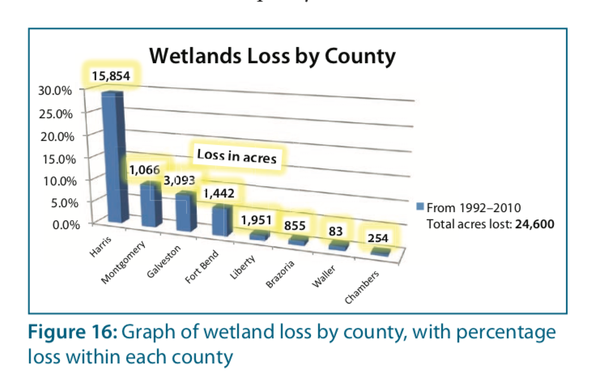
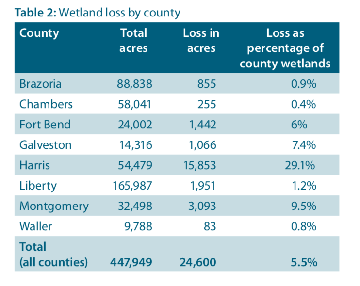
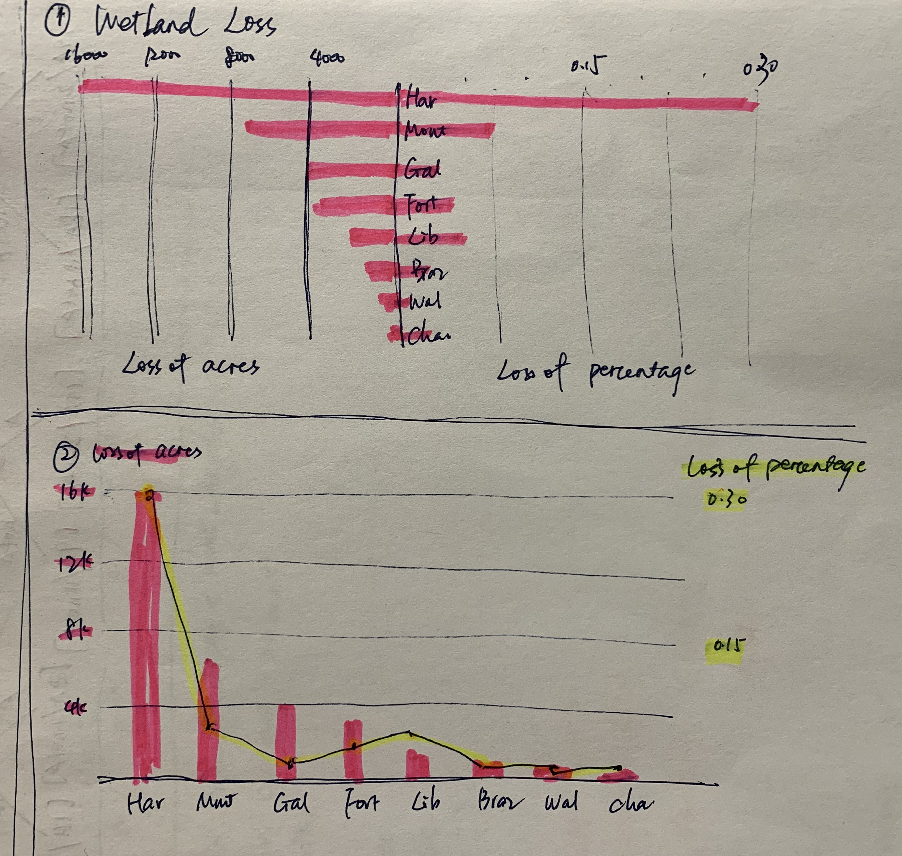
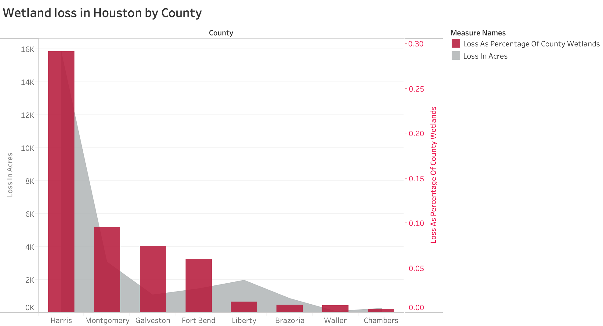

In this assignment, data visualization critique and recreation have been done.

# Data visualization source
The data vsualization is selected from a report named "Houston-Area Freshwater Wetland Loss,1992–2010", written by John S. Jacob. 
(Available at:https://cdn-ext.agnet.tamu.edu/wp-content/uploads/2019/04/ERPT-001-more-flooding-fewer-fish-freshwater-wetland-loss-in-the-houston-area-1992-2010-1.pdf).

The data visualization is shown as followed.

Its data source can also be found in the source as shown below.

This data visualization displays the loss of the natural freshwater wetlands in Houston by each county. As we all known, Houston is suffering from serious flooding over decades, called flooding capital. The flooding is especially serious in Harris County. It is urgent to figure out the reasons and find the effective solutions. Many hints implicate the wetland loss is a main reason of Houston’s frequent flooding. The government, researchers and citizens are all want to get information about this issue. This chart displays the wetland loss of each county, giving people an intuitive impression. The information is valuable for researches on many fields while its design has some problems. Thus, I choose this chart to do the critique and recreating.

From the chart, we can learn that most of losses occurred in Harris, Montgomery, Brazoria and Fort Bend Counties. The greatest losses were in Harris County, where almost 30 percent of the freshwater wetlands have disappeared. It lost 15855 acres of wetlands, almost twice the amount of the other seven counties combined. 

It uses percentage as its y-axis to display how many percent of wetlands have disappeared in each county and displays bars in descending order, showing the wetland loss degree of each county compared with its ordinary wetland area. 
However, it labels the accurate number of acres each county lost on the top of each bar with gleamy border. This actually gives another information but it might make readers confused with its meaning. 
Also, the legend says the total acres lost is 24600 acres, marking with blue square, which is the color of the bar. This will mislead readers to regard the height of the bar as the percentage of total loss of Houston. 
Besides, the chart uses shining labels and chooses 3D model, making it seems a little messy. 

# Wireframe and test the solutions
To improve the problems introduced in the former part, I came up with two solutions. One is to seperate the loss as acres and loss as percentage into two chart and put them together sharing one y-axis. The left part uses acres as unit while the right part uses percentage. In this way, readers can check information more conveniently. The other is to draw them in one chart sharing x-axis. Bars represent the loss as acres and lines display loss as percentage. Use same color in bar (line) and legends (labels) to show its category.

After sharing my wireframe to my friends, I got feedback as follow.

Bo Pang:
"I can got its mean. But the color pair looks weird. I think the second one is better as it displays the information in a more suitable way. Too many bars make the chart looks heavy. However, I think it is better to mark the chart more clearly like creating a leagnd to tell which represents the acres and stuff. "

Lishan: 
"I think this graph clearly display the difference of wetland loss in the absolute number(acres) and their relative size to the whole wetland. The use of the acres loss data and percentage loss data drawn on the same graph will help the reader get a comprehensive understanding of the situation：acres loss for the magnitude of the loss; percentage for the severity of damage to individual wetlands. However, the horizontal axis label is not very clear. I don't think abbreviations are a good idea as people don't really know about the names or whatever these labels are. If they are names, the line connecting each data in percentage does not make sense as it's not on a time scale."

They both chose the second chart and gave me suggestion like changing color, creating a legend, not using abbreviations and not using a line to connect each data. I agreed with their opinions. 

# Recreated data visualization
After thinking of my friends suggestion, I changed the line to area to represent the loss as percantage. I used Tableau to recreate the data visualization as shown below.

In the new edition, red and gray are used to show the urgent condition and make it looks better. Readers can check what the bar and area mean through the legend and axis titles clearly. The opacity of the bars is set as 80% to let readers see the area's condition. All of this design makes the visualization easier to be understand.

