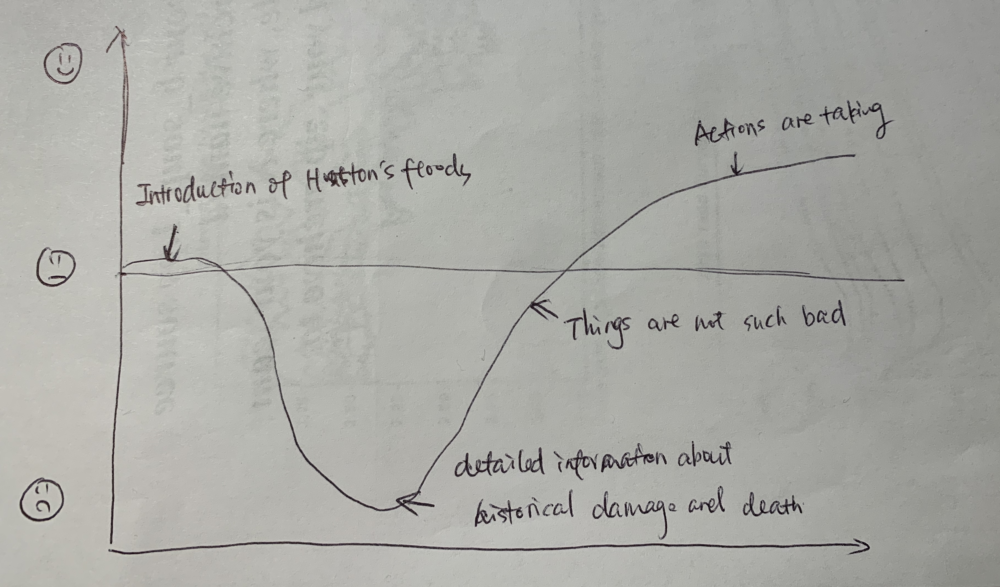
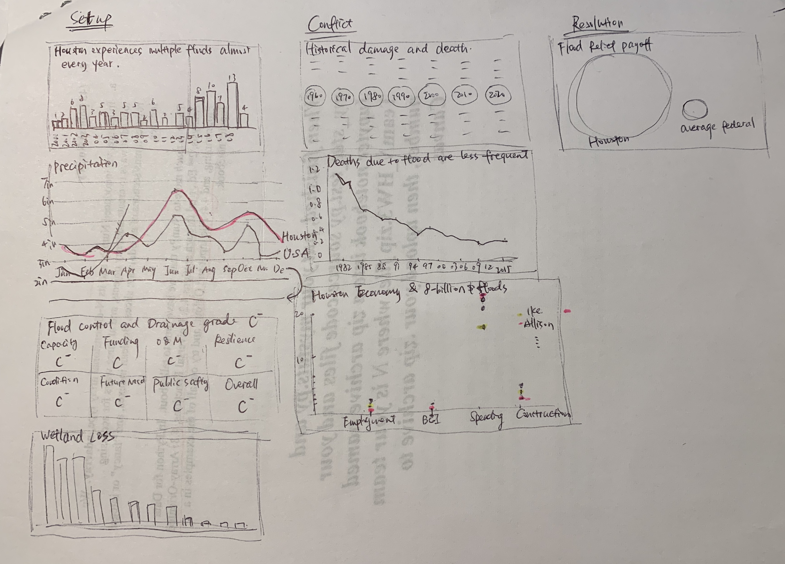

# Final Project Part 1

## Outline
## High-level summary: The floods in Houston is serious but as not such bad thing as widely believed.

In my final project, I will introduction the information about Houston floods events through data visualizations of many aspects. According to the story structure in the Good Charts book, I will divide my story into three parts: setup, conflict, and resolution.

**Setup: Houston experiences several flood events almost every year due to three reasons.**

Houston, as the flood capital, experiences multiple flood events almost every year and has been hit hard by major, destructive floods since its founding over 180 years ago.[1]
There are three main reasons that account for the flooding formation in the Houston. The first one is the special geography situation in Houston. Houston is located along the Texas Gulf Coast with approximately 80 km coastline [2] Houston sits just under 50 feet above sea level and is among the flattest major metropolitan areas in the U.S, which makes the drainage system cannot drain away the water efficiently. [3] In addition, the adjoining prairie land drains into the city, which is prone to flooding. [4] Secondly, Houston has abundant rainfall all the year round, averaging about 1,260 mm annually based on records between 1981 and 2010. [3] The last one is human influence. Houston has experienced rapid population and urbanization growth without proper zoning regulations in recent years.[3] So that large-area hardened pavements have replaced the original permeable and moist natural surface, which has caused great changes in the hydrological process in urban areas. [5] Meanwhile, due to the climate change influence, the hot and humid lakes have shrunk in large areas, resulting in the decrease of natural water storage capacity and the increase of surface runoff. [5]

**Conflict:  Many people think the flood events seriously affect the Houston in many aspects beyond remedy. However, the fact is not such serious as widely convinced.**

It is fact that the flood events cause huge damage and death from 180 years ago. Many actions have been taken these years, but huge floods continuously hurt the city.
For example, Allison, the costliest tropical storm in the history of the United States, had left Harris County, Texas, with 22 fatalities, 95,000 damaged automobiles and trucks, 73,000 damaged residences, 30,000 stranded residents in shelters, and over $5 billion in property damage in its wake. [6]
However, things are not such bad.
1. Large numbers of deaths due to flood are less frequent since the 1980s.
2. For Harvey in particular, Houston’s economic base was left virtually unscathed by the flood.
3. There are many lessons learned from previous floods. For example, since the 1970's, there has been flood insurance to ease the financial impact of flooding.  (The Texas Medical center, Commercial real estate, apartments and home construction……)

**Resolution: Many actions are undertaken.**

Due to U.S. News, in 2017, the average federal flood relief payouts were about $3,000 per square mile, but for Houston, the payouts were nearly a whopping $500,000 per square mile.[7] Thus, there will be a huge budget available for the flood control scheme by taking the damage into consideration. Everything is going to be better.

**Story line**

I will first introduce the fact that there are several flood events happen every year in Houston. When the audience sees it, the mood will be calm. When three reasons are given including natural and artificial reasons, audience might feel a little sad since human activity has aggravated the flood. When coming to the conflict, detailed information about the historical damage and death caused by each huge flood event will be presented, the audience will feel very sad. Nevertheless, according to the statistical data, we can find that the deaths due to flood are less frequent these years and there are no evidence proves the flood affect Houston’s economy. At this point, the audience will feel delighted .At the end of the story, I will introduce that Houston’s flood relief payouts are much more than federal average payouts. And several methods of flooding mitigation will be given. The audience mood will be balanced.

## Sketches

(In the third dataviz of Conflict, I will use scatter diagram, using different color to represent different flood event.)

## Data

1. Houston experiences multiple flood events almost every year.

https://weather.com/storms/severe/news/2019-05-09-houston-americas-flood-capital

2.The precipitation of Houston is much more than the average rainfall in U.S

https://www.usclimatedata.com/

http://www.cnyweather.com/wxrainsummary.php

3. ASCE grade

https://ascehouston.org/images/downloads/Report_Card/asce_houston_report_card___full_report_rev.pdf

4. The wetland loss in Houston; Houston-Area freshwater wetland loss 1992-2010;Texas Coastal Watershed Program 

5.Historical damage and death

https://www.hcfcd.org/About/Harris-Countys-Flooding-History

6.Houston economy & 8-billion dollars floods

https://www.bauer.uh.edu/centers/irf/houston-updates-feb18.php

7. Deaths due to flood are less frequent

http://www.wxresearch.com/almanac/houflood.html

8. Houston’s flood relief payouts are much more than federal average payouts

http://www.houstontx.gov/budget/18budprop/FY2018_Proposed_Budget.pdf

## Method and medium
I planned to do this project using **Shorthand**.

I will put a joint picture of Houston flood events using the “Text Over Media” section.

Then I will start my story with indroducing that there are several floods events happen in Houston almost every year. In the “Scrollmation”, I will add three visualizations showing three different reasons causing the seious floods. 
After letting the audience know the basic information of Houstion, I will show them the historical damage and death of floods event using ‘Reveal’.  Then I will use the “Scrollmation” again to things are not such bad. Two data visualizations will be displayed.

Finally, I will use ‘Reveal’ again to compare the Houston’s flood relief payouts with average federal budget to let audience know actions have been taken to solve the problem. Then, ‘Text’ will be used to introduce some methods and my ideas.

## Reference:
[1]Jonathan Erdman. (2019.9). Is Houston the Nation's Flood Capital? 
Retrieved from: https://weather.com/storms/severe/news/2019-05-09-houston-americas-flood-capital

[2] US Census Bureau facts Archived 2010-02-20 at the Wayback Machine
Retrieved from: https://www.nbcnews.com/storyline/hurricane-harvey/why-does-houston-flood-so-often-so-heavily-n796446

[3] Schaper, David (August 31, 2017). "3 Reasons Houston Was A 'Sitting Duck' For Harvey Flooding". NPR. Archived from the original on March 27, 2018.

[4] Baddour, Dylan (May 31, 2016). "The trouble with living in a swamp: Houston floods explained". Houston Chronicle. Archived from the original on August 29, 2017.
Retrieved from: https://www.houstonchronicle.com/local/explainer/article/The-trouble-with-living-in-a-swamp-Houston-7954514.php

[5] He Wenhua. Study on effect of urbanization on storm flood and flood simulation at Jinan city [D]. Guangzhou: South China University of Technology, 2010. 
Retrieved from: https://weather.com/storms/severe/news/2019-05-09-houston-americas-flood-capital

[6] https://www.hcfcd.org/About/Harris-Countys-Flooding-History

[7] U.S.NEW (2017.8). 
Retrieved from: https://www.nbcnews.com/storyline/hurricane-harvey/why-does-houston-flood-so-often-so-heavily-n796446
