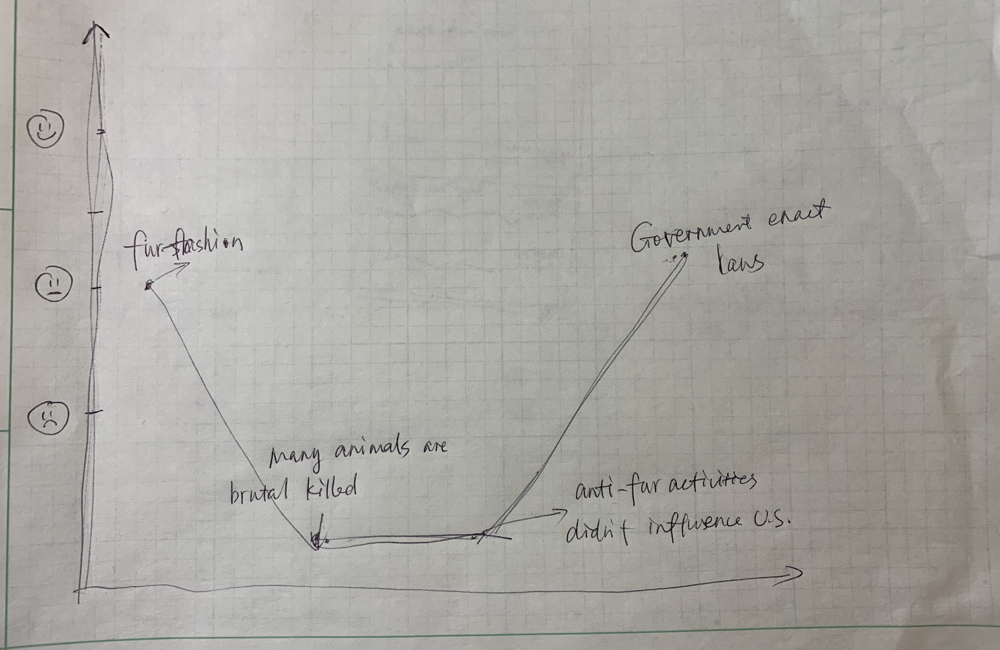
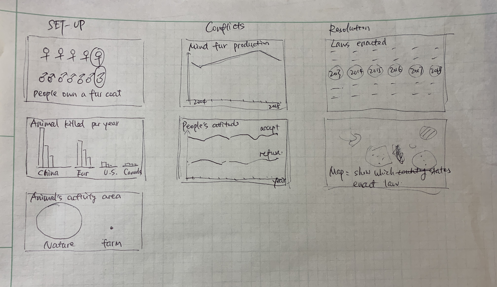

# Final Project Part 1_new

## Outline
## High-level summary: A huge number of animals are killed due to fur industry and actions are needed..

In my final project, I will introduction the information about animals killed due to fur industry through data visualizations of many aspects. According to the story structure in the Good Charts book, I will divide my story into three parts: setup, conflict, and resolution.

**Setup: Fur is considered to be a fashion statement in the world. Many animals are cruelly killed due to fur industry.**

There are more designers working with fur today than in the ’80s. In 1985, 19% of women own a fur coat and 7% of men wear fur.

Each year, around one hundred million animals are bred and killed on intensive fur farms. In addition to fur farming, huge numbers of animals are trapped and killed for their fur in the wild. 

Animals are confined in small, barren, wire cages for their entire lives. Unable to express their basic natural behaviors such as digging, roaming large territories and, for semi-aquatic mink, swimming and diving. Farm owner feed them with the cheapest food and inject hormones to create oversized “monster foxes” with larger fur.
Traps inflict great pain and anguish, both to the target animals and to unintended victims such as pets and endangered species. Often left for days, unable to seek shelter, food or water, these animals can cause serious injury to themselves in an attempt to escape. When the trappers finally arrive, they will often stomp or beat the animals to death.

**Conflict: There are many anti-fur organizations calling on fur-free activities. However, the fur sales maintain increasing trend and peoples’ attitude didn’t change.**

There are more than 50 anti-fur organizations calling on fur free activities over the world.However, it doesn’t influence much in U.S.

Mink fur sales in the United States have increased much between 2004 and 2014, from $2563 million to $3471 million, an increase of 35%.

In the United States, the proportion of people who find fur “morally acceptable” appears to have held relatively constant majority for the past decade according to the findings of the Gallup polls.

88% of all Americans say the animal rights movement has had NO influence on their decision to buy fur.

**Resolution: Some countries have adopted legislation to limit fur farming, but further measures are needed.**

The tide is turning against the practice of fur production as concerns about animal welfare and the ethics of fur continue to grow. 

Dataviz: Laws are diverse in strength in different countries.

Dataviz: Among them, many EU Member States have already adopted legislation to prohibit or limit fur farming, but further measures are needed.

**Story line**

I will first introduce the fact that fur fashion attracts many people. When the audience sees it, the mood will be calm. When they learn there are huge number of animals are brutal killed every year, audience might feel sad. When they see the pictures and data, they will feel these animals are so pitiful. When coming to the conflict, many anti-fur activities have happened while things haven’t come better in U.S.,  the audience will feel very sad. Nevertheless, according to the statistical data, we can find that the governments begin to notice these questions and they enact laws to protect the animals. At this point, the audience will feel delighted .At the end of the story, they will find that actions are still needed, and it takes on everyone. And donate method will be given. The audience mood will be balanced.

## Sketches

Graphs mostly will be made using tableau and data wrapper.The examples are showed below.

***
<iframe title="Animals killed due to fur industry (million)" aria-label="Stacked Bars" id="datawrapper-chart-4nfws" src="//datawrapper.dwcdn.net/4nfws/1/" scrolling="no" frameborder="0" style="width: 0; min-width: 100% !important; border: none;" height="237"></iframe>

***

<iframe title="People's attitude towards fur products in U.S." aria-label="Stacked Bars" id="datawrapper-chart-yz7Af" src="//datawrapper.dwcdn.net/yz7Af/1/" scrolling="no" frameborder="0" style="width: 0; min-width: 100% !important; border: none;" height="453"></iframe>

***

## Data

1 19% of women own a fur coat and 7% of men wear fur.

[www.fur.org](https://www.fur.org/fica-facts/)

2 Each year, around one hundred million animals are bred and killed on intensive fur farms.

[www.hsi.org/news-media/fur-trade/](https://www.hsi.org/news-media/fur-trade/)

3 Animals life in farm.

[thefurbearers.com](https://thefurbearers.com/sites/default/files/downloads/FurFarmStatsJuly2014.pdf)

4 U.S. Mink Production, 2004 – 2018

[furcommission.com/production-statistics](https://furcommission.com/production-statistics/)

5 peoples’ attitude towards fur fashion

[faunalytics.org](https://faunalytics.org/wp-content/uploads/2015/05/Fundamentals_Fur.pdf)

6 Laws are diverse in strength in different countries.

[www.animallaw.info/intro/fur-production-and-fur-laws](https://www.animallaw.info/intro/fur-production-and-fur-laws)

7 Many EU Member States have already adopted legislation to prohibit or limit fur farming, but further measures are needed.

[https://www.furfreealliance.com/wp-content/uploads/2019/06/Facts-on-fur-farming-legislation.pdf)

## Method and medium
I planned to do this project using **Shorthand**.
The basic version is showed as following.

[preview.shorthand](https://preview.shorthand.com/qDy0zUN0zhOqRmwj)

