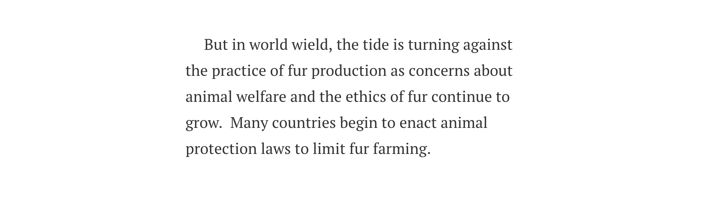

# Final Project Part 2

After talking with my several friends, I found my previous project about Houston Flood is not interesting at all. It is a huge complicated question and not comparable with my high-level summary. I couldn't illustrate the issue clearly using these data visualizations. Thus, I decide to change a topic and recreate the part-1. My new topic is about anti-fur products.

There is my part1 recreate version.

[final_project_part1_new](/final_project_part1_new.md)

## Storyboard

***

***

***

***

***

***

***

***

## Research protocol
### Target Audience
Everyone can be the audience of my story, especially people who like fur products. Those who want to buy a fur coat will be reminded by my story to buy a faux-fur coat. 

### Questions
Are those pictures appropriate? (Evaluate the engagement of the story.)

Do you feel useful of the visualization? (Evaluate the usefulness and completeness of the visualization.)

Can you clearly understand the visualization? (Evaluate the perceptibility of the visualization.)

Can you understand the visualization from the first view? (Evaluate the intuitiveness of the visualization.	)

Do you think visualizations are beautiful and appealing? (Evaluate the aesthetics and engagement of the visualization.)

Do you feel comfortable about the logic of the story? (Evaluate the logic of story.	)

### Participants
I hope to find people in three groups to do my survey.

•	Teenagers under 18 years old.

•	People aged between 18-30, including who catch fashion well and like fur products.

•	Middle-aged people.
### Methods
I hope to do a 10 mins interview in person.
## Script
### Introduction

I will begin with a brief introduction: “Hello, my name is Zichen Fan, a graduate student in Carnegie Mellon University. Could you help me do a survey in 10 min?”
If get the positive answer, I will continue with “I want to get feedback from the audience to improve my project. Please feel free to express any of your opinions :)”

### Main section
I will guess the age of my interviewer and ask “Are you interested in fashion?” “Do you like fur products?” to distinguish the audience group.

•	“Would you please tell me what you think this story is talking about?”

•	“Do you feel engaged of the story?”

•	“Can you get useful information from the data visualizations?”

•	“Can you easily understand the visualizations??”

•	“Do you think the storyboard is beautiful?”

•	 Which part do you think can be improved?”

•	“What else makes you confused, if any?”

•	“What your idea about buying fur products?”

•	“Do you have any other questions about the webpage?”

### Wrap-up
“Thank you so much for your time and patience! ”

## Findings
I completed three interviews with my friends and relatives. One of them is a cool girl who likes wearing brushy coats. One of them is my aunt who like buying clothes. One of them is my cousin who is in high school and doesn’t care about fashion and animals.

I summarized the feedback of the survey.

### Positive:
•	They can grasp the topic.

•	Most of the visualizations were clear.

•	All the graphs are in the same color scheme, which makes the article neat and aesthetically pleasing.

•	Provided useful information.

•	Most logic of the story was comfortable.

•	People all think it is wrong to consume fur products. They thought faux fur is warm enough and same fire as the real fur.

### Negative:

•	Some of the data visualizations are too small.

•	The words in some page are too much to read.

•	In the sixth page, it is more important to introduce the negative influence neither the number of organizations.

•	The visualization on 'animals activity areas in farm and nature' don't really make sense in the way it was presented.

•	The gap for mink production is not explained.

•	It needs some introduce between the U.S. productions and the law part.

•	The story lacks an ending or conclusion and the transits between sections could be a little smoother so readers will think they are flowing through the story rather than reading blocks of disintegrated Information.

•	They want the method to help the animals.

## Changes
•	Change the size of data visualizations in scroll parts.

•	Delete some text.

•	Recreate the visualization on 'animals activity areas in farm and nature'.

•	Add some transit.

•	Add the explain of the gap in “mink products” graph.

•	Add the conclusion.

•	Add the “learn more” button providing method to donate.

## Revised Storyboard

***

***

***

***

***

***

***

***

***

***

***

***

***
