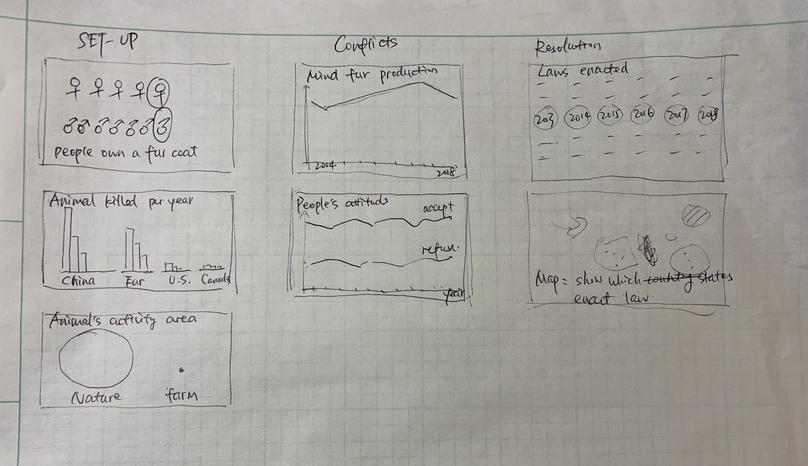
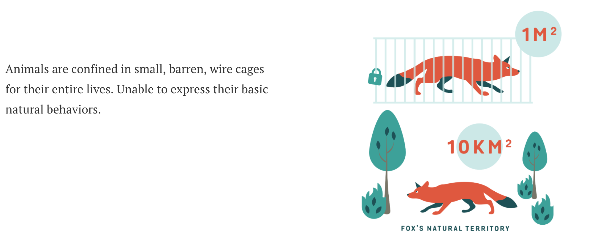
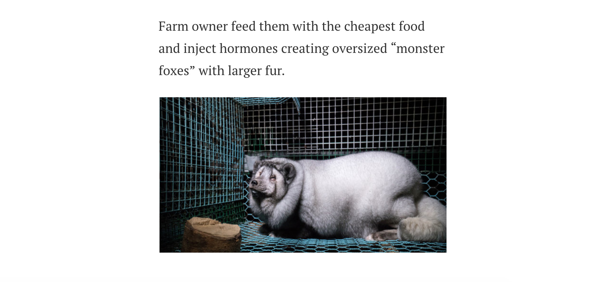
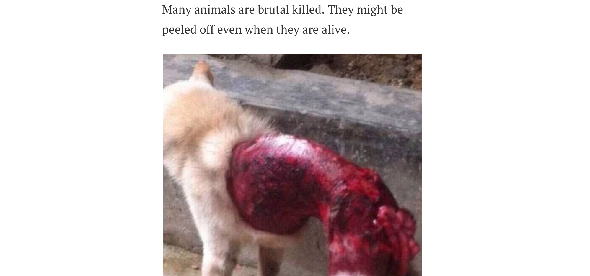
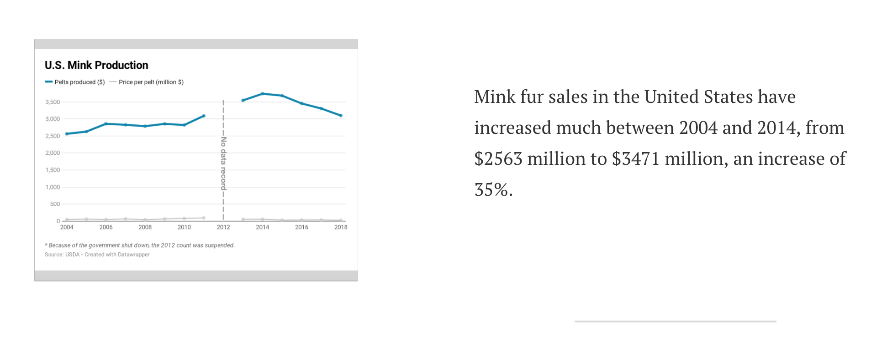
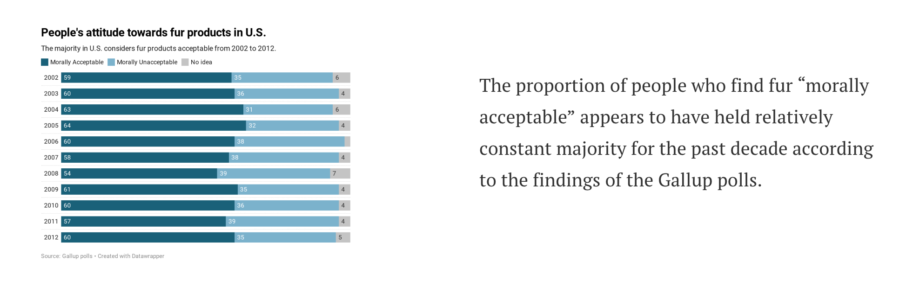
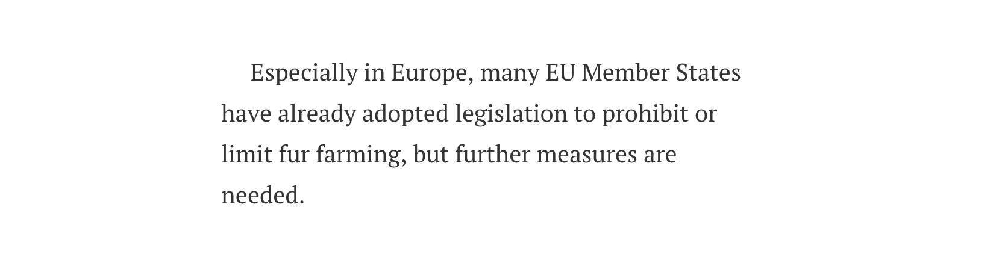

# Final Project Part3

## The idea

### High-level summary: A huge number of animals are killed due to fur industry and actions are needed.
In my final project, I will introduction the information about animals killed due to fur industry through data visualizations of many aspects. According to the story structure in the Good Charts book, I will divide my story into three parts: setup, conflict, and resolution.

**Setup: Fur is considered to be a fashion statement in the world. Many animals are cruelly killed due to fur industry.**

Dataviz1: 19% of women own a fur coat and 7% of men wear fur.

Dataviz2: Each year, around one hundred million animals are bred and killed on intensive fur farms and in the wild.

Dataviz3: Animals are confined in small, barren, wire cages for their entire lives. Unable to express their basic natural behaviors.

**Conflict: There are many anti-fur organizations calling on fur-free activities. However, the fur sales maintain increasing trend and peoples’ attitude didn’t change.**

There are more than 50 anti-fur organizations calling on fur free activities over the world.However, it doesn’t influence much in U.S.

Dataviz4: Mink fur sales in the United States have increased much between 2004 and 2014.

Dataviz5: In the United States, the proportion of people who find fur “morally acceptable” appears to have held relatively constant majority for the past decade according to the findings of the Gallup polls.

**Resolution: Some countries have adopted legislation to limit fur farming, but further measures are needed.**

Dataviz6: Laws are diverse in strength in different countries.

Dataviz7: Among them, many EU Member States have already adopted legislation to prohibit or limit fur farming, but further measures are needed.

***
### Data
1 19% of women own a fur coat and 7% of men wear fur.

[www.fur.org](https://www.fur.org/fica-facts/)

2 Each year, around one hundred million animals are bred and killed on intensive fur farms.

[www.hsi.org/news-media/fur-trade/](https://www.hsi.org/news-media/fur-trade/)

3 Animals life in farm.

[thefurbearers.com](https://thefurbearers.com/sites/default/files/downloads/FurFarmStatsJuly2014.pdf)

4 U.S. Mink Production, 2004 – 2018

[furcommission.com/production-statistics](https://furcommission.com/production-statistics/)

5 peoples’ attitude towards fur fashion

[faunalytics.org](https://faunalytics.org/wp-content/uploads/2015/05/Fundamentals_Fur.pdf)

6 Laws are diverse in strength in different countries.

[www.animallaw.info/intro/fur-production-and-fur-laws](https://www.animallaw.info/intro/fur-production-and-fur-laws)

7 Many EU Member States have already adopted legislation to prohibit or limit fur farming, but further measures are needed.

[https://www.furfreealliance.com/wp-content/uploads/2019/06/Facts-on-fur-farming-legislation.pdf)

**All data used in this project are summerized in this file.(click [here](https://drive.google.com/file/d/1gHXY1NlPDEMdsHKhrQfYpvp11Qwqg6PR/view?usp=sharing) to get the data.)**
***

### Method and medium
I planned to do this project using **Shorthand**.

I will put a photo of the poor fox on the homepage to get the attention of the audience using the “Text Over Media” section. Then I will start my story with the status quo of the people owning fur coat using “Reveal” section. In the “Text”, I will add two visualizations showing the animals killed each year and animals' terrorist in nature vs. fur farm. Then, I will introduce more information about animals'life in farm and give some bloody pictures showing the poor animals might be skinned when thay are alive. At this time, audience will be mad of humans' brutal acitivities. Then, I will use 'text' again to show two more dataviz about U.S. mink sale and people's attitude. After that, I will introduce that government are taking actions. Two dataviz will be given in 'Text'.
Finally, I will appeal to audience for stopping buying fur products.  I will also express my understanding of no buying no killings and it takes for all of us.  I will add a “Media” section and embed some link to animal protection website.
***
## Design and user research

### Sketches and storyboards
**Sketches**

**Storyboard**

***

***

***

***

***

***

***

***

***

### User research protocol and findings

**Target Audience**: Everyone can be the audience of my story, especially people who like fur products. Those who want to buy a fur coat will be reminded by my story to buy a faux-fur coat.

**Questions**

Are those pictures appropriate? (Evaluate the engagement of the story.)

Do you feel useful of the visualization? (Evaluate the usefulness and completeness of the visualization.)

Can you clearly understand the visualization? (Evaluate the perceptibility of the visualization.)

Can you understand the visualization from the first view? (Evaluate the intuitiveness of the visualization. )

Do you think visualizations are beautiful and appealing? (Evaluate the aesthetics and engagement of the visualization.)

Do you feel comfortable about the logic of the story? (Evaluate the logic of story. )

**Participants**

People in three groups: Teenagers under 18 years old; People aged between 18-30, including who catch fashion well and like fur products; Middle-aged people.

**Methods** : a 10 mins interview in person.

**Script**:

I will begin with a brief introduction: “Hello, my name is Zichen Fan, a graduate student in Carnegie Mellon University. Could you help me do a survey in 10 min?” If get the positive answer, I will continue with “I want to get feedback from the audience to improve my project. Please feel free to express any of your opinions :)”. Then, I will guess the age of my interviewer and ask “Are you interested in fashion?” “Do you like fur products?” to distinguish the audience group. After that, I will ask my main questions. Finally, the interview will ends in “Do you have any other questions about the webpage?” and “Thank you so much for your time and patience! ”.
***
**Findings**
I completed three interviews with my friends and relatives. One of them is a cool girl who likes wearing brushy coats. One of them is my aunt who like buying clothes. One of them is my cousin who is in high school and doesn’t care about fashion and animals.

I summarized the feedback of the survey.

**Positive:**
• They can grasp the topic.

• Most of the visualizations were clear.

• All the graphs are in the same color scheme, which makes the article neat and aesthetically pleasing.

• Provided useful information.

• Most logic of the story was comfortable.

• People all think it is wrong to consume fur products. They thought faux fur is warm enough and same fire as the real fur.

**Negative:**

• Some of the data visualizations are too small.

• The words in some page are too much to read.

• In the sixth page, it is more important to introduce the negative influence neither the number of organizations.

• The visualization on 'animals activity areas in farm and nature' don't really make sense in the way it was presented.

• The gap for mink production is not explained.

• It needs some introduce between the U.S. productions and the law part.

• The story lacks an ending or conclusion and the transits between sections could be a little smoother so readers will think they are flowing through the story rather than reading blocks of disintegrated Information.

• They want the method to help the animals.

**Changes:**

• Change the size of data visualizations in scroll parts.

• Delete some text.

• Recreate the visualization on 'animals activity areas in farm and nature'.

• Add some transit.

• Add the explain of the gap in “mink products” graph.

• Add the conclusion.

• Add the “learn more” button providing method to donate.
***
### Wireframes
After getting feedback, I improved my storyboard.

***

***

***

***

***

***

***

***

***

***

***

***

***
***
## Final data story
### Intended audience

My intended audience is everyone. At first, I intend to let people protect animals but the topic is too large. I searched many information about the poor things animals suffered and got the findings like bunch fires and slaughters. Since few information I can get about the fires, I focused my topic on animal slaughters.  Fur farm is one of the main area killing most animals unnecessarily.  Animals are treated crudely and killed brutal there.  This kind of slaughter is because of the huge demand of fur fashion. Since no buying no killing, I intend to let people stop buying fur products or concern more to those organizations that help animals.
***
### Works

So far, I could feel that as my understanding of how to tell an entire story deepens and my project was improved a lot.  At first, I only had a general idea of what topic I want to tell.  After drawing the outline, I defined the setup, conflict and resolution to get a clear logic of the story.  Making sketches helped me think how to visualize the data pointing to my topic. According to the sketches, I created several dataviz and put them into the first storyboard. I generated a user research protocol before I conducted user research interview. I got really useful feedback from the interviewees. I found lots of problems which I couldn’t find by myself.  Since I was very familiar with my topic and the data, I could easily grasp the mean of the dataviz. My friends who were strange with my project were able to point out which dataviz was confused and where had some logic problems.  I recreated these dataviz and added many transit between the dataviz to make the story more smooth.  Also, I put some poor animals images into my storyboard directly at first, the nice grader advised me to add a warning before showing the scared images. All of them helped me improve my project.
***
### Final project link

Click [here](https://carnegiemellon.shorthandstories.com/zichen-say-no-to-fur/index.html) to view my final project.
***
### Reference
Data Source:

[1] “FICA Facts”, Fur information council of America. [Online].Available: https://www.fur.org/fica-facts/.[Accessed: 15-Feb-2020].

[2] “The Fur Trade”, Human Society Internatinal. [Online].Available:https://www.hsi.org/news-media/fur-trade/. [Accessed: 15-Feb-2020].

[3] “International Fur Farm Statistics”, APFA. [Online].Available:https://thefurbearers.com/sites/default/files/downloads/FurFarmStatsJuly2014.pdf. [Accessed: 15-Feb-2020].

[4] “U.S. Mink Production, 2004 – 2018”, Fur Commission USA. [Online].Available: https://furcommission.com/production-statistics/. [Accessed: 15-Feb-2020].

[5] “Public Attitudes Toward Fur”, Human Research Council. [Online].Available: https://faunalytics.org/wp-content/uploads/2015/05/Fundamentals_Fur.pdf. [Accessed: 15-Feb-2020].

[6] “Fur Production and Fur Laws”, Animal Legal&Historical Center. [Online].Available:https://www.animallaw.info/intro/fur-production-and-fur-laws. [Accessed: 15-Feb-2020].

[7] “Fact on fur farming legislation”, Fur Free Alliance. [Online].Available:https://www.furfreealliance.com/wp-content/uploads/2019/06/Facts-on-fur-farming-legislation.pdf [Accessed: 15-Feb-2020].

Image Source:

[1]Photo by [Jonatan Pie](https://unsplash.com/photos/V__yW0wQCOs) on [Unsplash](https://unsplash.com/)

[2]Image by [Oikeutta eläimille](https://oikeuttaelaimille.fi/jattinaalien-kasvatus-tarhoilla-jatkuu) from [thedodo](https://www.thedodo.com/in-the-wild/monster-fox-fur-farms)

[3]Image from [kknews](https://kknews.cc/pet/eo2e2mr.html)

## Related

[final_project_part1](/final_project_part1_new.md)

[final_project_part2](/final_project_part2.md)

[final_story](https://carnegiemellon.shorthandstories.com/zichen-say-no-to-fur/index.html)
